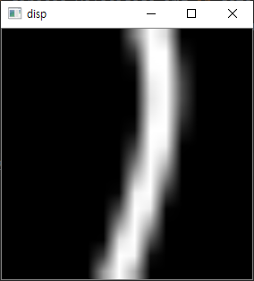

# AI RC Car
## 개요

|               시연 영상 1                |               시연 영상 2                |
| :--------------------------------------: | :--------------------------------------: |
|  |  |

CNN으로 방향을 예측하여 주행하는 자율주행자동차(AI RC Car)에 사용된 소프트웨어입니다.

HW : Arduino + Raspberrypi + Pi camera

SW : Driving SW(Python) + CNN Predictor(Keras)


## Train Data

|  |   |   |   |
| -------------------------------- | --------------------------------- | --------------------------------- | --------------------------------- |
|  |   |   |   |
|  |  |  |  |

Pi camera를 통해서 516장을 촬영한 후 직접 라벨링했습니다.

데이터는 `train_img_final516.p`에 저장되어있으며 `get_image_data.py`를 통해서 load합니다.


## CNN Predictor

[네트워크 설명]

`keras_learn.py`에 구현되어있습니다.


## RC Car Interface

`picameraStream.py`를 이용하여 이미지를 촬영합니다. `picameraStream.py`는 더 효율적으로 picamera를 이용하는 소스코드입니다(https://github.com/jrosebr1/imutils/blob/master/imutils/video/pivideostream.py). 이 소스코드의 함수를 이용하면 다음 프레임 나올 때까지 block돼서 cpu 손실이 없다고 합니다. 

촬영된 이미지는 OpenCV를 통해서 전체 명암의 중간값으로 필터링 및 흑백 반전 후 16*16으로 resize됩니다.

```python
# Invert black and white with threshold
ret, img2 = cv2.threshold(img.astype(np.uint8), threshold, 255, cv2.THRESH_BINARY_INV)
img2 = cv2.resize(img2,(16,16), interpolation=cv2.INTER_AREA )
```

`rc_car_interface.py`에 구현되어있습니다.


## Driving SW

최종적으로 RC Car Interface를 통해 이미지를 촬영한 후 CNN Predictor에서 방향을 예측한 후에 그 값을 기준으로 좌회전, 직진, 우회전을 결정합니다. 그리고 아두이노에 신호를 보내 방향과 속도를 조절합니다.

`self_driving.py`에 구현되어있습니다.


## HW 관련 주의사항

이미지를 촬영 시 그림자가 부분적으로 생기면 트랙과 혼동하여 예측값이 잘못 나올 수 있습니다.

A4용지와 같이 넓은 면적으로 그림자를 고르게 만들면 예측값이 제대로 나옵니다.